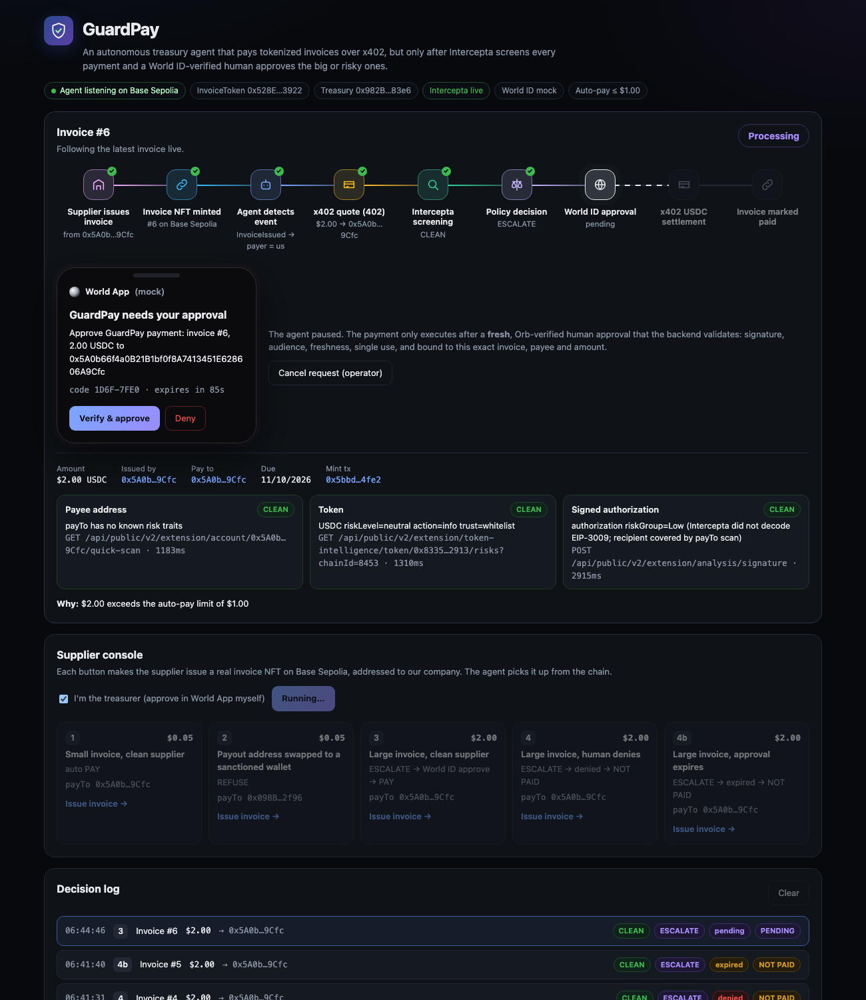
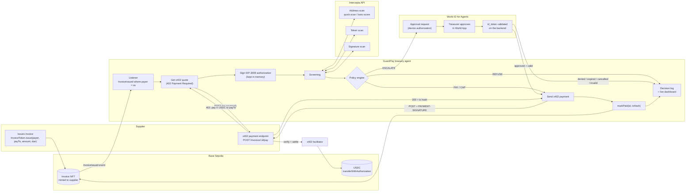
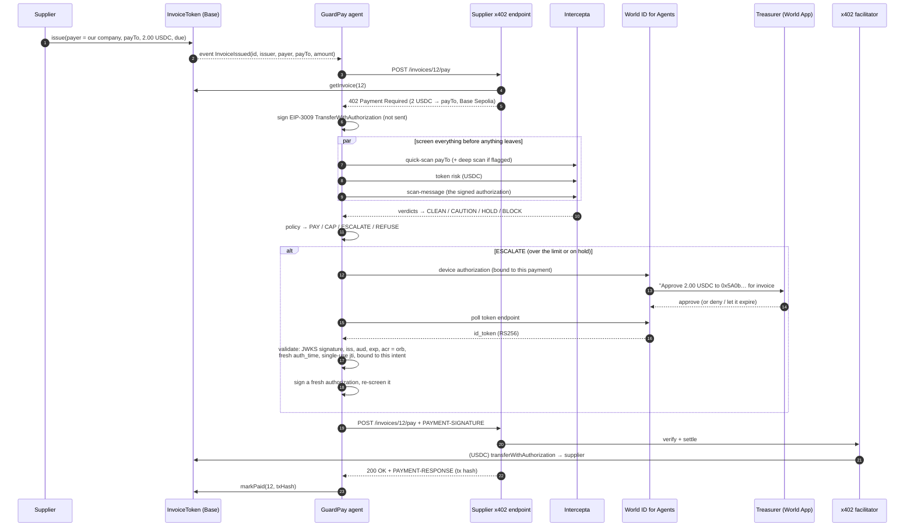
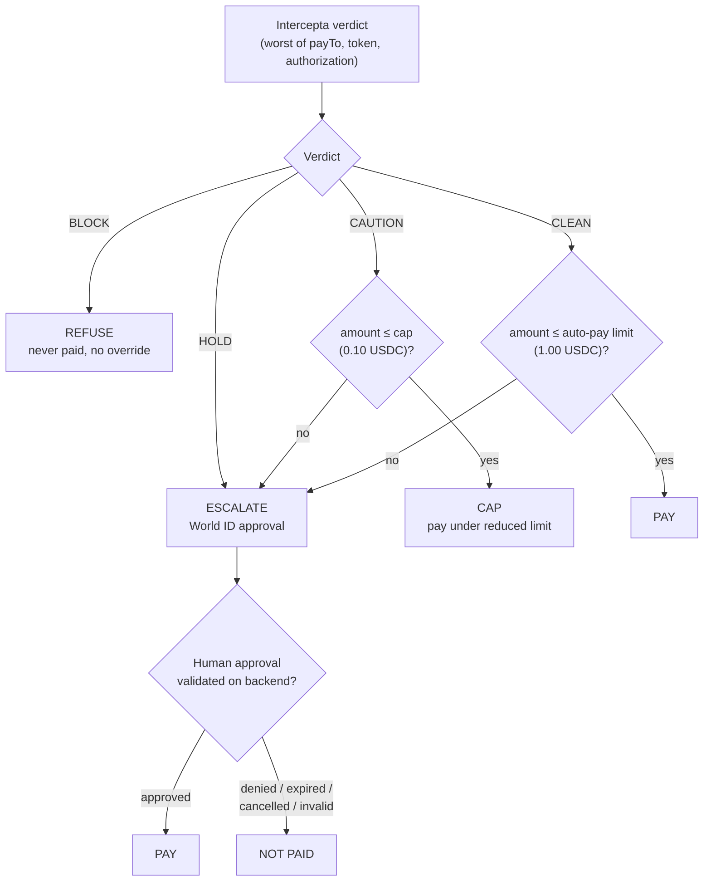

# GuardPay

**An autonomous treasury agent that pays tokenized supplier invoices over x402, and screens every payment with Intercepta before it signs anything away. For large or risky payments it also requires a fresh World ID-verified human approval.**

Built at ETHGlobal Tokyo 2026 · Base Sepolia · testnet USDC



## Team

| Name | Contact |
| --- | --- |
| Gautam Bansal | [@Gautambnsl](https://github.com/Gautambnsl) |
| Anshul Vats | anshulvatz@gmail.com |

---

## The problem

Companies are starting to let AI agents move money: paying suppliers, subscriptions and APIs. x402 makes that easy: any HTTP endpoint can say *"402: pay me 2 USDC"*, and an agent can pay it in one request.

That's also the attack surface:
- **Payout-address swaps:** a supplier's payout address is quietly replaced with an attacker's wallet.
- **Fake invoices:** an invoice that looks like it came from a real supplier.
- **Sanctioned wallets:** money sent to an address that's legally off-limits.
- **Agent compromise:** a prompt-injected or compromised agent signs whatever it's told.

An agent that pays everything automatically is a liability. An agent that asks a human about everything is useless.

## The solution

GuardPay applies graduated trust to every payment:

| Situation | What GuardPay does |
| --- | --- |
| Small invoice, clean supplier | **Pays by itself** in seconds |
| Payee is a scammer or sanctioned wallet | **Refuses**: the signed payment is never sent |
| Large invoice, or anything suspicious | **Pauses** and asks a real, Orb-verified human via World ID |
| Human denies, approval expires, or it's cancelled | **Not paid** |

Every decision is recorded with its verdict, its reason, the human approval (if any) and the on-chain transaction.

---

## How it works

### End to end



### One invoice, step by step



### Decision policy



**How the screening verdicts are set:**

| Check | BLOCK | HOLD | CAUTION | CLEAN |
| --- | --- | --- | --- | --- |
| **payTo address** (quick-scan, then toxic-score if anything is found) | a hard trait: `known_scammer`, `sanction_address`, `blacklist`, `fake_phishing_*`, `rug_pull`…, or toxicScore ≥ 70 | toxicScore ≥ 40 | any other signal | none |
| **token** | `action=block`, `trust=blocklist` or `riskLevel=high` | – | `action=warn` or `riskLevel=medium` | – |
| **signed authorization** | riskGroup High, drainer or malicious detectors, or signed `to`/`value` ≠ the screened payTo/amount | riskGroup Medium | – | – |
| **Intercepta unreachable** | – | **HOLD**: fail closed, a human decides | – | – |

### Why the invoice is an NFT

An invoice is a **receivable**: the supplier's right to be paid. The supplier issues it and holds the NFT, so it can also sell it to a financier for early cash (invoice factoring) without changing where the payment goes. The invoice names the **payer**, and only the payer's agent can mark it paid. Payment status and the settlement transaction are public and verifiable.

---

## Live on Base Sepolia

| | |
| --- | --- |
| InvoiceToken | [`0x528E823E4Bc38ea662eA53b91f311394C9D33922`](https://sepolia.basescan.org/address/0x528E823E4Bc38ea662eA53b91f311394C9D33922) |
| Treasury (payer) agent | [`0x982BBcD31e83bF2c80E7EBe02C95245a08ab83e6`](https://sepolia.basescan.org/address/0x982BBcD31e83bF2c80E7EBe02C95245a08ab83e6) |
| Supplier | [`0x5A0b66f4a0B21B1bf0f8A7413451E628606A9Cfc`](https://sepolia.basescan.org/address/0x5A0b66f4a0B21B1bf0f8A7413451E628606A9Cfc) |

In every run, the supplier issued the invoice on-chain, the agent picked it up from the `InvoiceIssued` event, and the screening used the live Intercepta API.

| # | Scenario | Intercepta | Decision | World ID | Outcome | Transactions |
| --- | --- | --- | --- | --- | --- | --- |
| 1 | $0.05, clean supplier | CLEAN | PAY | – | **PAID** | [issue](https://sepolia.basescan.org/tx/0xe701e54d1decddcfed03069a254dd97d5e11de055a210146787961e41c973549) · [USDC](https://sepolia.basescan.org/tx/0x9c47ff29d1d766f0c9b362c1ef969f912647e07fa5ef7ad0fb00fdbcd47c02e7) · [markPaid](https://sepolia.basescan.org/tx/0x40821286e02f178d1c2b6aa46845cc1aa7149a3c4503a399306b55863e0d4558) |
| 2 | $0.05, payout swapped to a sanctioned wallet (Ronin exploiter) | **BLOCK**: toxicScore 100, `known_scammer`, `sanction_address`, `blacklist`, `fake_phishing_transfer` | REFUSE | – | **REFUSED**: nothing sent | [issue](https://sepolia.basescan.org/tx/0x7dc6d5f7e8f14e0810c3909350dfdfd637be0f7a5d126e518acff75a432232df) |
| 3 | $2.00, clean supplier | CLEAN | ESCALATE (> $1) | approved and validated | **PAID** | [issue](https://sepolia.basescan.org/tx/0x38753d7109ebd0ff0c46b99437352f24737d300cffc734c333ecd5e6ef1dacf2) · [USDC](https://sepolia.basescan.org/tx/0x2d2ea2858076760ff61ff818ce5e2636635581a1ec58db6d4d874fe5d9d890d3) · [markPaid](https://sepolia.basescan.org/tx/0x8070ad6cde58d4be1b4ba5adbd5fd0217f187cd8666c3faaff3ce2b467e33ae2) |
| 4 | $2.00, human denies | CLEAN | ESCALATE | denied | **NOT PAID** | [issue](https://sepolia.basescan.org/tx/0x26bfc61edb09658b78f73c9a6471ceec66a6accffed2a390b23632121f5ed680) |
| 4b | $2.00, approval expires | CLEAN | ESCALATE | expired | **NOT PAID** | [issue](https://sepolia.basescan.org/tx/0x2447772255c9a50801622c3bcf818aa19bc7371743dcc671465063baa015cef1) |

The run above used `WORLD_MODE=mock`, our local issuer that speaks the same OIDC protocol, for the World ID steps. The same flow was then run against **World's official sandbox** (`WORLD_MODE=oidc`, `https://sandbox.auth.world.org`), with a human approving on World's page and GuardPay validating the returned id_token (issuer `https://sandbox.auth.world.org`, audience = our client ID, `acr = https://world.org/oidc/acr/orb-v3`, fresh `auth_time`, single-use `jti`):

| Invoice | Amount | Intercepta | World ID (official sandbox) | Outcome | Transactions |
| --- | --- | --- | --- | --- | --- |
| #7 | $2.00 | CLEAN | approved, id_token validated | **PAID** | [issue](https://sepolia.basescan.org/tx/0x76355e839618401f177c6940def0b9e75b2550f52bbbfbcea804c0797be51caf) · [USDC](https://sepolia.basescan.org/tx/0x88ba993f690dc27e778520882d7ce89110189d507be7321bc61351b9c8121881) · [markPaid](https://sepolia.basescan.org/tx/0x19731bcfae58ad17ffc589789fb1f855694bd95a317a8cd579b297fe1769a557) |
| #8 | $2.00 | CLEAN | approved, id_token validated | **PAID** | [issue](https://sepolia.basescan.org/tx/0x486aff7de19c85577ad84ef292f7c44f217f0417550d4c609145e1ab0165d983) · [USDC](https://sepolia.basescan.org/tx/0xdc0402ef666062b92659fb963e0f86ebee03870eb669563e7f018100e76e24c7) · [markPaid](https://sepolia.basescan.org/tx/0xc8395f47a0e22f785cd61944d330211b3fe6459fafa3bcb56414514a0bcac7ab) |
| #12 | $2.00 | CLEAN | approved, id_token validated | **PAID** | [issue](https://sepolia.basescan.org/tx/0xfa5120973f01347d15dd984b363a946a8a57ed3f1bcfe92b80004afb0f52ffbb) · [USDC](https://sepolia.basescan.org/tx/0x2d8047ac5af15ca618909c4a9fa31969781edebcf2470c216a8e79db3652b15d) · [markPaid](https://sepolia.basescan.org/tx/0x3c103a253ba11f63b38a98040af5df1e87a3b780d511d526ca3853708c6c5680) |

---

## Repo layout

| Path | What |
| --- | --- |
| [contracts/src/InvoiceToken.sol](contracts/src/InvoiceToken.sol) | ERC-721 receivable: issuer, payer, payTo, amount, dueDate, paid, paymentRef. Suppliers issue; only the payer can `markPaid` |
| [seller/src/server.ts](seller/src/server.ts) | The supplier's x402 endpoint. `POST /invoices/:id/pay` is priced and routed per invoice, read from the chain |
| [agent/src/listener.ts](agent/src/listener.ts) | Watches `InvoiceIssued` events addressed to our company |
| [agent/src/agent.ts](agent/src/agent.ts) | The agent loop: quote → sign → screen → policy → approval → pay → markPaid → log |
| [agent/src/x402.ts](agent/src/x402.ts) | x402 buyer split into quote / sign / submit, so the exact authorization can be screened first |
| [agent/src/intercepta.ts](agent/src/intercepta.ts) | Intercepta screening pipeline and verdict mapping |
| [agent/src/policy.ts](agent/src/policy.ts) | Policy engine |
| [agent/src/worldid.ts](agent/src/worldid.ts) | World ID for Agents: approval request, polling, backend token validation, intent binding |
| [agent/src/server.ts](agent/src/server.ts) | Agent API for the dashboard. All secrets stay server-side |
| [web/](web/) | Live dashboard (Vite + React) |

## Setup

Requirements: Node 20+, Foundry.

```bash
npm install
npm run contracts:install   # forge-std + OpenZeppelin
cp .env.example .env
```

Fill in `.env`:

| Variable | What |
| --- | --- |
| `AGENT_PRIVATE_KEY` | Treasury agent wallet on Base Sepolia. Fund it with USDC ([faucet.circle.com](https://faucet.circle.com)) and a little ETH for `markPaid` |
| `DEPLOYER_PRIVATE_KEY` | Deploys the InvoiceToken (it can be the same key) |
| `CLEAN_SUPPLIER_ADDRESS` / `SUPPLIER_PRIVATE_KEY` | Supplier wallet. It issues invoices, so it needs a little ETH, and it receives the USDC |
| `RISKY_SUPPLIER_ADDRESS` | A known-risky mainnet address used in scenario 2. The default is the Ronin exploiter (OFAC-sanctioned) |
| `INTERCEPTA_API_KEY` | Intercepta / Web3 Antivirus API key |
| `WORLD_MODE`, `WORLD_CLIENT_ID`, `WORLD_CLIENT_SECRET` | `oidc` plus sandbox client credentials from the [World ID for Agents portal](https://sandbox.auth.world.org/portal). `mock` runs a protocol-identical issuer for offline development |

Then deploy the contract:

```bash
npm run deploy              # prints INVOICE_TOKEN_ADDRESS=0x… → add it to .env
```

## Run

```bash
npm run seller   # supplier x402 endpoint     :4021
npm run agent    # treasury agent + listener   :4000
npm run web      # live dashboard              :5173
```

In the dashboard's **Supplier console**, each button makes the supplier issue a real invoice on Base Sepolia. The agent picks it up from the chain, and the pipeline shows each stage as it happens. Tick **"I'm the treasurer"** to approve or deny in the World App card yourself. Click any row in the decision log to replay that run.

Headless: `npm run demo` runs every scenario and prints a summary.

## Test

```bash
npm test          # Foundry (InvoiceToken) + agent tests (policy, verdicts, integrity check, World ID validation)
npm run typecheck
npm run screen -w agent -- 0xAnyMainnetAddress   # one live Intercepta screening
```

The World ID tests cover approve, deny, expire and cancel. They also check that the backend rejects **replayed**, **stale**, **forged** and **wrong-audience** tokens, and an approval reused for a **different payment**.

---

## Intercepta: Safe Agent-to-Agent Payments with x402

Every payment is screened **before the agent's signed x402 authorization leaves the process**. All calls are live (`https://api.web3antivirus.io`, `X-API-KEY`).

| What | Endpoint | Code |
| --- | --- | --- |
| HTTP client (auth, timeout, rate-limit spacing, 429 retry) | – | [agent/src/intercepta.ts:46-86](agent/src/intercepta.ts#L46-L86) |
| payTo quick scan | `GET /api/public/v2/extension/account/{address}/quick-scan` | [agent/src/intercepta.ts:120](agent/src/intercepta.ts#L120) |
| payTo deep scan (if the quick scan finds anything) | `GET /api/public/v2/extension/account/{address}/toxic-score` | [agent/src/intercepta.ts:125](agent/src/intercepta.ts#L125) |
| token scan | `GET /api/public/v2/extension/token-intelligence/token/{address}/risks` | [agent/src/intercepta.ts:160](agent/src/intercepta.ts#L160) |
| signed x402 authorization (EIP-712) | `POST /api/public/v2/extension/analysis/signature` | [agent/src/intercepta.ts:235](agent/src/intercepta.ts#L235) |
| authorization integrity (signed `to`/`value` = screened payTo/amount) | – | [agent/src/intercepta.ts:222](agent/src/intercepta.ts#L222) |
| pipeline entry | `screenPayment()` | [agent/src/intercepta.ts:263](agent/src/intercepta.ts#L263) |
| called before paying, and again after human approval | – | [agent/src/agent.ts:63](agent/src/agent.ts#L63), [agent/src/agent.ts:86](agent/src/agent.ts#L86) |
| verdict → decision | `decide()` | [agent/src/policy.ts:27](agent/src/policy.ts#L27), called at [agent/src/agent.ts:67](agent/src/agent.ts#L67) |

**Visible verdicts.** Blocked and approved payments show up in the dashboard and in the table above, with Intercepta's own traits as the reason.

**Mainnet intelligence, testnet settlement.** Intercepta's data is mainnet, so GuardPay handles the two sides differently:
- It screens the real payTo address unchanged.
- It maps the testnet asset and the EIP-712 domain to their Base mainnet equivalents: USDC `0x8335…2913`, chainId 8453.

**API feedback:**
- The per-endpoint OpenAPI specs, and the `.md` versions of the docs, made the integration fast. An agent can read them directly. Address and token scans returned clear, actionable results within about 1s.
- **`scan-message` doesn't decode EIP-3009 `TransferWithAuthorization`**, which is the exact thing x402 signs. It returns `messageType: null`, no addresses and riskGroup `Low`, even when `to` is a sanctioned address. We cover this with the payTo scan plus a local check that the signed `to` and `value` match the screened quote. Native x402 support would make this the one-call safety check for agent payments.
- The API key is rate-limited per second, so three parallel calls returned **HTTP 429**. We space requests out and retry. Documenting the limit, or adding a `Retry-After` header, would help.
- `quick-scan` returns **404** for contract addresses. A payTo can legitimately be a smart wallet or a splitter, so a verdict for contracts would help. We fail closed to human approval.
- The `toxicScore` scale isn't documented; from live data it appears to be 0–100. A recommended action, like `action: block|warn` on token scans, would remove guesswork from integrators' thresholds.

## World: Best Use of World ID for Agents

**The protected action:** releasing company money. A payment above the auto-pay limit, or one Intercepta puts on hold, executes **only** after a fresh approval from an Orb-verified human through World ID for Agents. That approval is validated on GuardPay's backend.

| Journey step | Implementation |
| --- | --- |
| Verification request | OIDC device authorization grant to the World ID for Agents issuer. It carries a human-readable description of the exact payment: [worldid.ts:132](agent/src/worldid.ts#L132) |
| User completion | The treasurer approves (or denies) in World App. The dashboard shows the pending request with its countdown |
| Validated result | Backend validation of the id_token, covering the JWKS signature, `iss`, `aud`, `exp`, `acr = orb-v3`, a fresh `auth_time`, a single-use `jti` and an optional approver allowlist: [worldid.ts:234](agent/src/worldid.ts#L234) |
| Protected agent action | x402 payment and `markPaid`. The approval is consumed once and only for the matching intent hash (invoice, payTo, asset, amount, network): [worldid.ts:269](agent/src/worldid.ts#L269), [agent.ts:77-82](agent/src/agent.ts#L77-L82) |
| Unsuccessful paths | **Denied**, **expired**, **cancelled** (by the operator) and **invalid** (the token fails validation) all end as **NOT PAID**. Scenarios 4 and 4b are shown live above |

No client secret reaches the browser. The dashboard can relay the human's action or cancel a request, but it can never mark anything approved.

### Why human approval is the minimum sufficient trust for large payments

**Screening can't answer whether a payment was intended.** Intercepta tells the agent a payee is *not known to be bad*. It can't tell the agent that *this* invoice is legitimate. A clean-looking address can still belong to invoice fraud, a compromised supplier or a prompt-injected agent.

**Weaker controls fail against those threats.**
- **More automated checks** can be fooled by the same attacker who fooled the agent.
- **An API key or a second agent** can be stolen or prompt-injected along with the first one.
- **A long-lived session** doesn't show that anyone looked at *this* payment.

**The minimum that closes the gap is one real, unique human**, freshly authenticated, explicitly approving exactly this payment within a short window. World ID provides that without KYC or personal data: GuardPay learns only that an Orb-verified person approved, under a pairwise identifier.

**Anything more would be friction without a matching threat.** Multisig quorums or KYC fall in this category.

**Anything less** (no approval, a cached session, or a replayable token) leaves the agent as a single point of failure.

**The cost stays low.** Small, clean payments remain fully autonomous, so humans only see the payments that need them.

### Integration debrief

- **Time to first success:** about 5 minutes from starting `worldid.ts` to the first backend-validated approval against our protocol-identical local issuer. After registering a sandbox app in the portal, the first real approval through `sandbox.auth.world.org` worked on the first try, a few minutes later, with no code changes. The client is standard OIDC: discovery, device authorization, token polling and JWKS.
- **Friction:**
  - `sandbox.auth.world.org/docs` is conceptual. We found the concrete endpoints (device authorization, token, JWKS, `acr` values) by reading `/.well-known/openid-configuration`.
  - The agent plugin helps a *coding* agent register apps; it isn't a runtime SDK for an autonomous agent.
  - Callback URLs must be HTTPS, so redirect flows don't work on localhost during a hackathon. The device grant avoids that.
- **Missing documentation:**
  - An end-to-end device-flow example: the expected errors (`authorization_pending`, `access_denied`, `expired_token`), the default `expires_in` and `interval`, and a sample id_token.
  - Whether `auth_time` is guaranteed fresh for every device approval.
  - How to bind an approval to a specific action.
- **The one improvement with the greatest impact:** first-class **action-bound approvals**. The agent would send a hash-bound, human-readable description of the action ("Pay 2.00 USDC to 0x5A0b… for invoice #12"), World App would display it, and the id_token would carry that hash. Today GuardPay enforces the binding server-side. In the token, "this human approved this exact action" would be verifiable by anyone.

## Curvegrid

**MultiBaas was not used.** The contract is deployed with Foundry, and the agent reads the chain and listens for events directly with viem.

---

## FAQ

**What is GuardPay in one sentence?**
An autonomous treasury agent that pays supplier invoices over x402, screens every payment with Intercepta first, and needs a World ID-verified human for large or risky ones.

**What problem does it solve?**
Agents that move money are a new attack surface: swapped payout addresses, fake invoices, sanctioned wallets, compromised agents. GuardPay lets small, clean payments run without a human, blocks the dangerous ones, and brings in a verified human only when it matters.

**Who does what?**
- The **supplier** issues an invoice NFT on-chain and runs an x402 payment endpoint.
- The **agent** listens for invoices addressed to its company, screens them, decides, and pays.
- **Intercepta** supplies the risk intelligence.
- **World ID** supplies the verified human approval.
- The **x402 facilitator** settles the USDC.

**Why x402?**
It's the emerging standard for agents paying over HTTP: no accounts or API keys, stablecoin settlement and machine-readable prices. The riskiest moment in an agent payment is when the agent signs the x402 authorization, and that's exactly where GuardPay sits.

**How does the x402 payment work?**
1. The agent calls the invoice's pay endpoint and gets `402` back, with the price and payTo.
2. It signs an EIP-3009 USDC authorization.
3. It calls again with the signature attached.
4. The facilitator verifies the signature, submits `transferWithAuthorization` on-chain and pays the gas.
5. The endpoint returns the transaction hash.

**What exactly does Intercepta check?**
Three things, before anything is sent:
- the **payTo address**: quick-scan, plus a deep scan if anything turns up
- the **token**
- the **signed payment authorization**

GuardPay also checks that the signature pays exactly the address and amount that were screened.

**What if Intercepta is down?**
GuardPay fails closed. The verdict becomes HOLD, so a human decides; it never auto-pays unscreened.

**Can the agent be tricked into paying a different address than the one screened?**
No. The signed authorization's `to` and `value` must equal the screened quote. The World ID approval is bound to a hash of the invoice, payTo, asset, amount and network. After approval, the agent signs a fresh authorization and re-screens it.

**Why World ID instead of a password, a second agent or a multisig?**
- A **password** or a **second agent** can be stolen or prompt-injected along with the first agent.
- **Screening** can't prove a payment was intended.
- World ID proves that a unique, real human freshly approved this payment, with no KYC and no personal data.
- A **multisig** adds friction without addressing a different threat.

**Could someone replay an old approval?**
No. Each token's `jti` is single-use. `auth_time` must come after the request. The approval is consumed once, for one specific payment. The tests cover replayed, stale, forged and wrong-audience tokens.

**What happens if the treasurer doesn't respond?**
The request expires and the invoice is not paid. The treasurer can also deny, and an operator can cancel. All of those end as NOT PAID.

**What are the limits?**
Configurable. Currently:
- **Clean:** up to $1.00 pays automatically.
- **Minor risk signals (CAUTION):** only up to $0.10.
- **Everything larger, or on hold:** needs a human.
- **Blocked:** never paid.

**Why is the invoice an NFT, and why does the supplier hold it?**
An invoice is a receivable: the supplier's right to be paid. As an NFT the supplier can hold it or sell it for early cash, and the payment status and receipt are public. The payer doesn't need to own it; its agent pays it and marks it paid.

**Who pays gas?**
- The **supplier** pays gas to issue the invoice.
- The **x402 facilitator** pays gas for the USDC transfer.
- The **agent** pays gas for `markPaid`.

**How does the agent know there's a new invoice?**
It watches the InvoiceToken contract for `InvoiceIssued` events where the payer is its own company, and processes each new invoice automatically.

**How do we know the payment really happened?**
The x402 settlement transaction hash is returned by the facilitator, logged, and stored on-chain in the invoice's `paymentRef` by `markPaid`. Anyone can check it on Basescan.

**Is this real money?**
It's testnet USDC on Base Sepolia, but the transactions are real and visible on Basescan. Moving to mainnet means changing the network and the facilitator URL.

**What did you learn about the sponsor APIs?**
See the Intercepta API feedback and the World integration debrief above. The biggest finding is that Intercepta's signature scan doesn't yet understand EIP-3009, the payload x402 actually signs.

**What would you build next?**
- On-chain settlement verification in `markPaid`
- Due-date scheduling with early-payment discounts
- Per-supplier payment history and anomaly detection
- Approver allowlists and quorums for very large payments
- Invoice factoring: selling the invoice NFT for early cash

## Security notes

- Secrets live in `.env` (git-ignored) and are read only by the Node processes. The browser talks to `/api` and never sees a key.
- World ID results are validated on the server only. An unvalidated client response is never treated as authorization.
- `REFUSE` is final. A signed-but-refused authorization is never sent to the seller.
